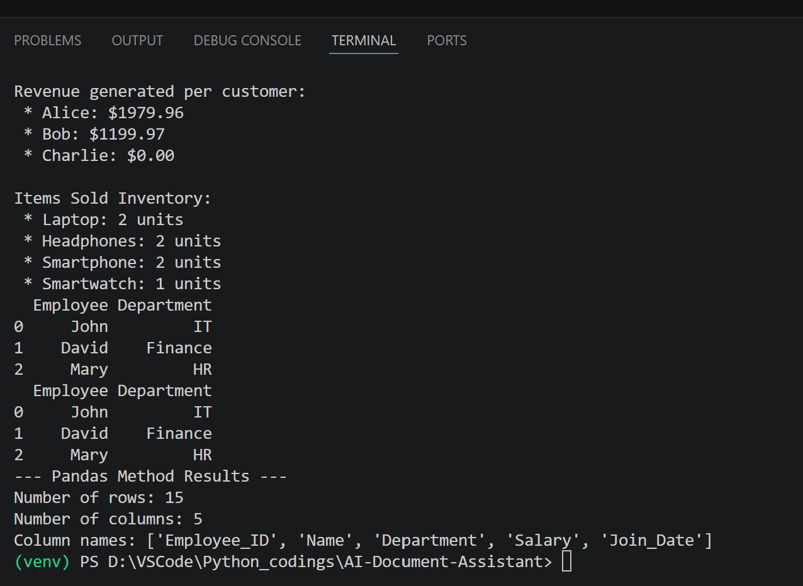
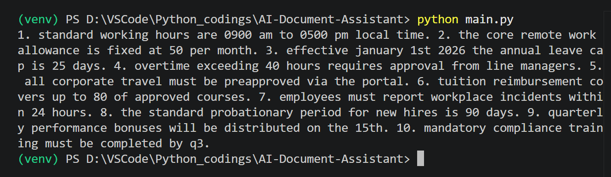
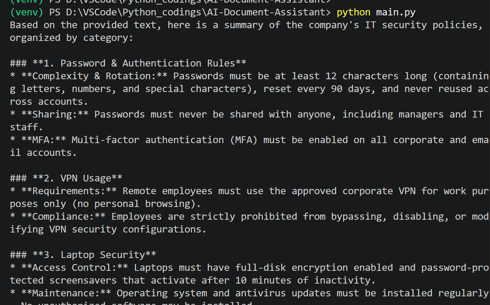

# AI Document Assistant

An enterprise-style AI application that allows users to upload documents and ask questions using Retrieval-Augmented Generation (RAG).

## Technologies

Python

LangChain

FAISS

Gemini

Streamlit

GitHub

## Status

Completed till AI Response

## Features Completed

- Read Text
- Read CSV
- Read PDF
- Clean Documents
- Gemini API Integration
- AI Summary Generation

## Preprocessing Pipeline

Our AI application utilizes a robust multi-stage preprocessing pipeline to convert raw, unstructured data into model-ready embeddings or structured inputs.

## Project Architecture
This application uses a modular three-tier layout (main.py, document_service.py, and gemini_client.py) to cleanly separate file loading from AI processing. It securely passes document data through a structured pipeline to generate text summaries using Google's gemini-3.5-flash model.

## Installation Instructions
Set up a Python virtual environment (python -m venv venv), activate it, and run pip install google-genai python-dotenv to install the dependencies. Finally, save your Google API key inside a local .env file and run python main.py to process your text document

